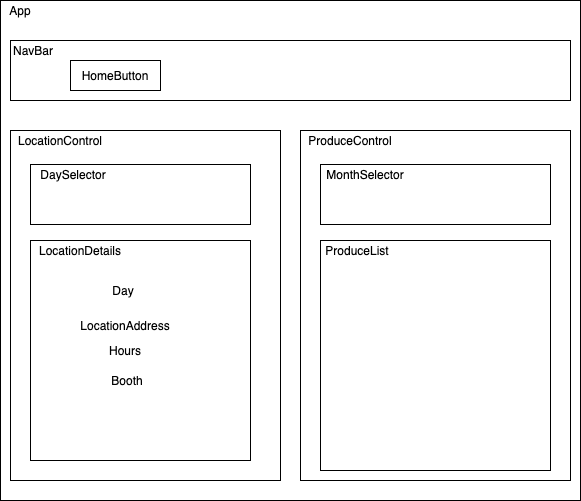

# Farmers market
## By: Ketuah Howard, Geoff Goetz, Patrick Kille, Michelle Morin || April 21st 2020
#### This project was bootstrapped with [Create React App](https://github.com/facebook/create-react-app).

## Description 

Fake Farmer's market website based around allowing users to figure out where to get the produce and what will be available.

Application based around practicing component trees and local state.

## Component Diagram
<!--  -->
;

## Project Specifications

### User Stories
- As a user, I want to be able to enter a date and discover where farmers market will be for that date
- As a user, I want to be able to see what produce is available on the current month

## Setup/Installation Requirements

#### Node install

###### For macOS:
_If Homebrew is not installed on your computer already, then install Homebrew by entering the following two commands in Terminal:_
* $ /usr/bin/ruby -e "$(curl -fsSL https://raw.githubusercontent.com/Homebrew/install/master/install)"
* $ echo 'export PATH=/usr/local/bin:$PATH' >> ~/.bash_profile

_Install Git with the following command:_
* $ brew install git

_Next, install Node.js by entering the following command in Terminal:_
* $ brew install node

###### For Windows:
_Please visit the [Node.js website](https://nodejs.org/en/download/) for installation instructions._

#### Install this application

_Clone this repository via Terminal using the following commands:_
* _$ cd desktop_
* _$ git clone {url to this repo}_
* _$ cd farmers-market_
_Then, confirm that you have navigated to the farmers-market project directory by entering "pwd" in Terminal._

_Next, install npm at the project's root directory via the following commands:_
* _$ npm install_
* _$ npm run build_

_Open the contents of the directory in a text editor or IDE of your choice (e.g., to open the contents of the directory in Visual Studio Code on macOS, enter the command "code ." in Terminal)._

## Known Bugs

_No known bugs at this time._

## Technologies Used

* Node.js
* Webpack
* npm
* Javascript
* jQuery
* React

### License

[MIT](https://choosealicense.com/licenses/mit/)

Copyright &copy; 2020 **_Keturah Howard, Patrick Kille, Michelle Morin, Geoff Goetz_**